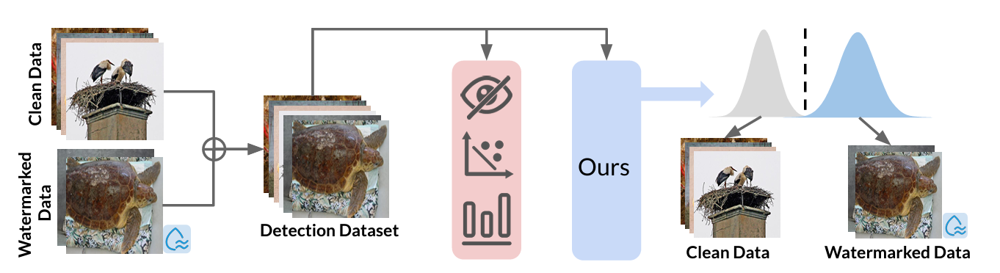

# WaterMark Detector (WMD)

<p align="center">

<p>

## Overview

**WaterMark Detector (WMD)** is the first invisible watermark detection method designed for a black-box and annotation-free setting. WMD is capable of detecting arbitrary watermarks within a given dataset using a clean, non-watermarked dataset as a reference. This approach does not rely on specific decoding methods or prior knowledge of the watermarking techniques, making it a versatile solution for detecting invisible watermarks in various scenarios.

## Key Features

- **Black-Box Detection**: Detects watermarks without needing prior knowledge of the watermarking techniques or decoding methods.
- **Annotation-Free**: Operates without requiring manual annotations of watermarked samples.
- **Versatile**: Effective across multiple datasets and watermarking methods.
- **High Performance**: Consistently achieves high detection AUC scores, surpassing 0.9 in most single-watermark datasets and exceeding 0.7 in multi-watermark scenarios.

## Methodology

WMD leverages the principles of offset learning, using a clean non-watermarked dataset to isolate the influence of watermarked samples in the detection dataset. This is achieved through a self-supervised learning approach, effectively distinguishing watermarked images from non-watermarked ones by analyzing distributional differences.

### Main Components

1. **Asymmetric Loss Function**: Designed to optimize the detection model by focusing more on hard examples in the clean dataset while ensuring watermarked samples in the detection dataset are maximized.
2. **Iteration Pruning**: An iterative strategy to progressively refine the detection dataset, retaining watermarked samples while removing clean ones with low loss values.

## Requirements
- Python 3.8 or higher
- PyTorch > 2.1.0

## Data Preparation

To start using the WMD project, you need to organize your data into separate folders for non-watermarked and watermarked images. Follow the steps below to prepare your dataset:

1. **Create Folders**:
    - Create a folder for non-watermarked images.
    - Create a folder for watermarked images. (Here we use the DctDwtSVD watermark as an example)

    For example:
    ```bash
    mkdir -p /home/ubuntu/data/imagenet/val
    mkdir -p /home/ubuntu/data/dctdwtsvd
    ```

2. **Move Images to Folders**:
    - Place all non-watermarked images in the `val` folder.
    - Place all watermarked images in the `dctdwtsvd` folder.

    The directory structure should look like this:
    ```
    /home/ubuntu/data/imagenet/val/
    ├── image1.jpg
    ├── image2.jpg
    ├── ...

    /home/ubuntu/data/dctdwtsvd/
    ├── watermarked_image1.jpg
    ├── watermarked_image2.jpg
    ├── ...
    ```

3. **Code Configuration**:
    - Update the `folders` list in the code to point to the paths of your non-watermarked and watermarked image directories.
    - Ensure that the `ratios` list reflects the proportion of non-watermarked to watermarked images. For example, `[0.95, 0.05]` means 95% of the images are non-watermarked and 5% are watermarked.

    ```python
    data_number = 10000
    ratios = [0.95, 0.05]

    folders = ['/home/ubuntu/data/imagenet/val/', '/home/ubuntu/data/dctdwtsvd/']

    mix_dataset = MixtureDataset(folders=folders, num_dataset=data_number, ratios=ratios, resize_dim=(256, 256), transform=transform, pre_load=False)
    mix_dataset_loader = torch.utils.data.DataLoader(mix_dataset, batch_size=batch_size, shuffle=False, num_workers=8)
    ```

By following these steps, you will have your datasets correctly organized and ready to be loaded into the WMD detection model.

## Quickstart
Run the ```WMD.ipynb``` to start the WMD.

## Results

WMD's effectiveness has been extensively evaluated across various datasets and watermarking methods. The model consistently achieves high AUC scores, demonstrating its robustness in detecting invisible watermarks under different conditions.

### Evaluation Metrics

- **AUC (Area Under the Curve)**
- **TPR (True Positive Rate) at 10% FPR (False Positive Rate)**
- **FPR at 90% TPR**

## Acknowledgments

This work was supported by Northeastern University and Sony AI. We would like to thank all contributors and reviewers for their valuable feedback.
